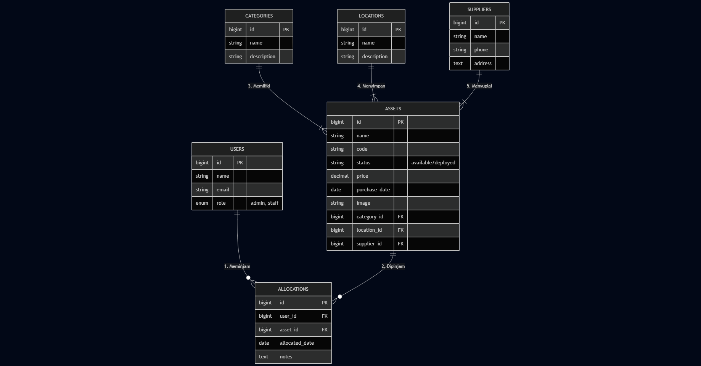

# 💎 SIMA IT - Enterprise Asset Management


> **Sistem Informasi Manajemen Aset IT** dengan desain *Glassmorphism* premium (Black & Gold). Solusi digitalisasi gudang IT untuk melacak *hardware*, *software*, dan peminjaman ke karyawan secara *real-time*.

---

## 🌟 Tentang Proyek

**SIMA IT** dibangun untuk memenuhi standar **UKK (Uji Kompetensi Keahlian)** Teknik Informatika. Aplikasi ini menangani siklus hidup aset perusahaan mulai dari pengadaan, penyimpanan, pendistribusian ke karyawan, hingga pelaporan.

Dibangun menggunakan **Laravel 11** dan **Tailwind CSS**, aplikasi ini menawarkan antarmuka modern yang responsif, aman, dan mudah digunakan.

---

## 🚀 Fitur Unggulan

### 🎨 Antarmuka (UI/UX Premium)
- **Sultan Theme:** Desain eksklusif Hitam & Emas dengan efek *Glassmorphism*.
- **Split Screen Login:** Halaman login modern dengan visual branding di sisi kiri.
- **Responsive:** Tampilan optimal di Desktop dan Mobile.
- **Interactive Dashboard:** Statistik *real-time* dan grafik visual.

### 🔐 Keamanan & Otorisasi
- **Multi-Auth:** Pembedaan akses antara **Administrator** dan **Staff (Karyawan)**.
- **Middleware Protection:** Mencegah akses paksa melalui URL (Error 403 Forbidden).
- **Secure Password:** Enkripsi Bcrypt.

### 🏢 Modul & Fungsionalitas

#### 👨‍💼 1. Administrator (IT Manager)
* **Executive Dashboard:** Melihat total aset, nilai valuasi aset (Rupiah), dan aset yang sedang dipinjam (Deployed).
* **Manajemen Data Master:**
    * **Kategori:** Mengelompokkan aset (Laptop, Server, ATK).
    * **Lokasi:** Mengatur denah penyimpanan (Ruang Server, Gudang).
    * **Supplier:** Mendata vendor tempat pembelian.
* **Registrasi Aset:** Input barang dengan upload foto, serial number, dan harga.
* **Sirkulasi Aset:**
    * **Peminjaman (Check-out):** Menyerahkan aset ke karyawan (Stok berkurang otomatis).
    * **Pengembalian (Check-in):** Mengembalikan status aset menjadi *Available*.
* **Laporan PDF:** Cetak laporan inventaris otomatis menggunakan DomPDF.

#### 🧑‍💻 2. Staff (Karyawan)
* **My Inventory Dashboard:** Melihat daftar barang yang sedang dipinjam/dipegang saat ini.
* **Katalog Aset:** Melihat daftar aset perusahaan (Read Only / Tanpa akses edit).
* **Transparansi:** Memastikan data barang yang tercatat sesuai dengan fisik yang diterima.

---

## 🛠️ Teknologi (Tech Stack)

| Komponen | Teknologi |
| :--- | :--- |
| **Backend Framework** | Laravel 11.x |
| **Frontend Framework** | Tailwind CSS (CDN) |
| **Database** | MySQL |
| **Template Engine** | Blade |
| **PDF Generator** | Laravel DomPDF |
| **Icons** | Heroicons (SVG) |
| **Font** | Inter & Outfit (Google Fonts) |

---

## 👤 Akun Pengujian (Default Credentials)

Gunakan akun berikut untuk simulasi UKK:

| Role | Email | Password | Akses |
| :--- | :--- | :--- | :--- |
| **Administrator** | `admin@gmail.com` | `admin123` | **Full Control** (CRUD, Settings, Report) |
| **Staff IT** | `staff@cyber.id` | `password123` | **Read Only** & Personal Inventory |

---


## ⚙️ Panduan Instalasi (Cara Menjalankan Project)

Ikuti langkah-langkah berikut secara berurutan untuk menjalankan proyek ini di komputer baru (Localhost).

### 1. Clone & Install Dependencies
Buka Terminal (Git Bash / CMD / Terminal VS Code), lalu jalankan perintah berikut:

```bash
# 1. Clone Repository (Download kodingan)
git clone [https://github.com/username-kamu/sima-it.git](https://github.com/username-kamu/sima-it.git)

# 2. Masuk ke Folder Project
cd sima-it

# 3. Install Library PHP (Wajib & Butuh Internet)
composer install

# 4. Install Library Frontend (Opsional jika pakai CDN, tapi disarankan)
npm install && npm run build

# 5. Duplikat file contoh environment
cp .env.example .env

# 6. Generate Kunci Aplikasi
php artisan key:generate

# 7. Buat Tabel & Isi Data Dummy (Seeder)
php artisan migrate:fresh --seed

# 8. Buat shortcut folder storage
php artisan storage:link

# 9. Jalankan Server Laravel
php artisan serve


***

### 💡 Cara Update ke GitHub:
Setelah kamu paste kode di atas ke file `README.md` di laptop, jangan lupa kirim ke GitHub biar aman:

```bash
git add README.md
git commit -m "Update panduan instalasi lengkap"
git push

   ## 📊 Desain Database (ERD)

